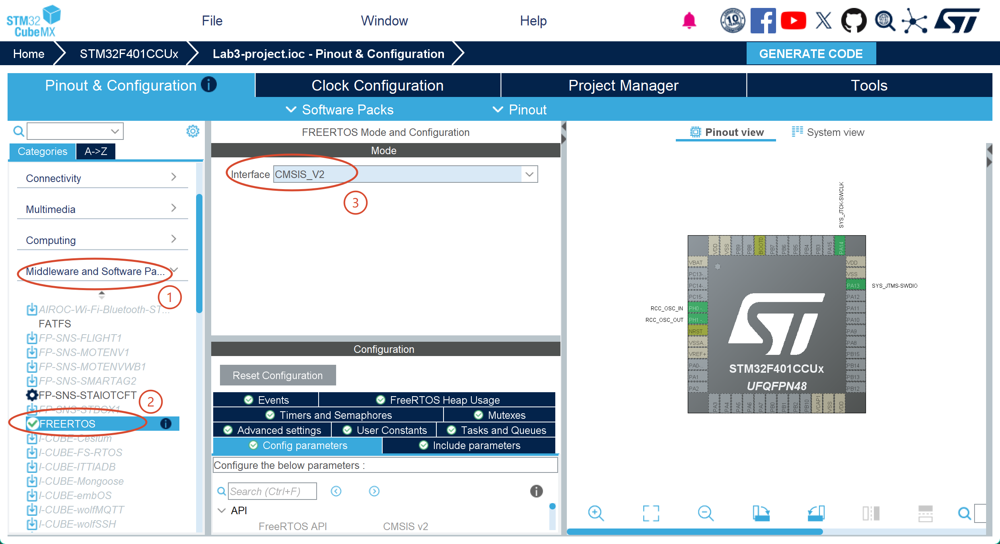
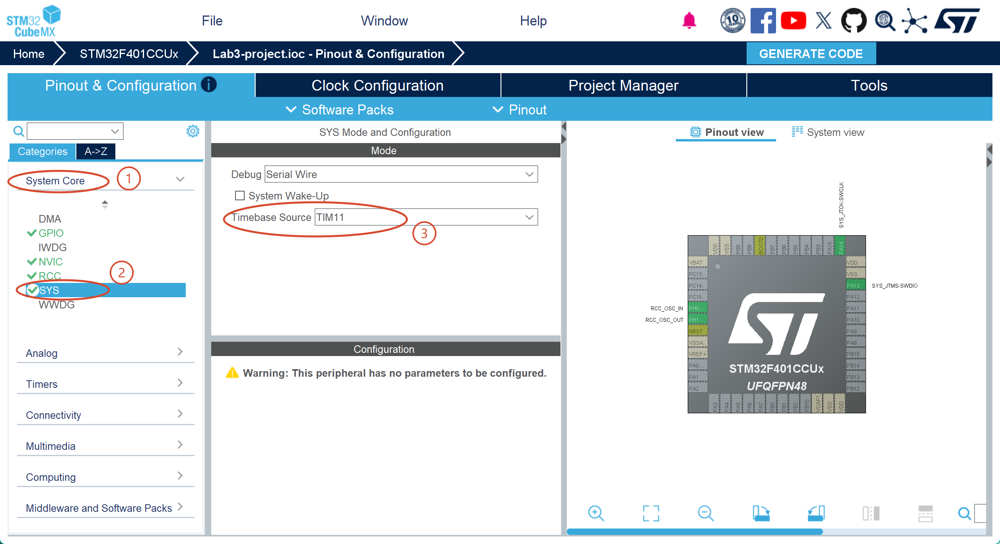
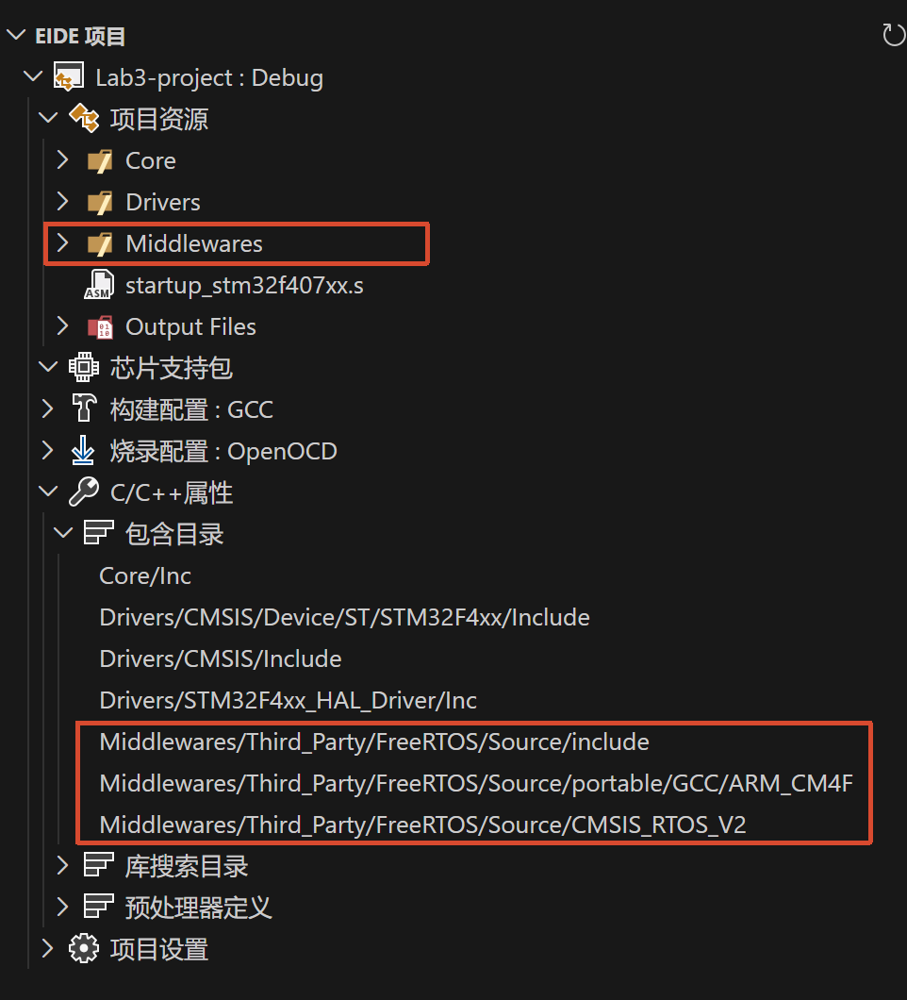
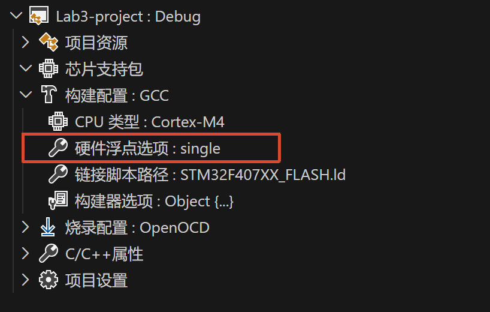

# 使用 CubeMX 配置 FreeRTOS

### 1. 启用 FreeRTOS

在 CubeMX 中启用 FreeRTOS 功能，并选择 CMSIS-RTOS V2 接口标准：



### 2. 配置 HAL timebase

FreeRTOS 会使用 SysTick 作为时间基准，因此我们需要将 HAL timebase 重新配置到另外的定时器。一般来说，我们选择功能最低级的 TIM 作为 HAL timebase，以将高级定时器留给其他功能使用。

对于 `STM32F401CCU6`，可以选择 `TIM10` 或 `TIM11`；对于 `STM32F407IGH6`，可以选择 `TIM6` 或 `TIM7`。

下图以 `STM32F401CCU6` 为例，选择 `TIM11` 作为 HAL timebase：



然后点击 CubeMX 的 "Generate Code" 按钮，生成代码。

### 3. EIDE 配置构建选项

需要把生成的 FreeRTOS 相关源文件添加到 EIDE 的构建系统中：


<br/>

### 4. FPU 问题

FreeRTOS 中对 FPU 的配置需与 EIDE 构建配置中的配置保持一致。可以尝试构建一次来判断是否配置正确。

使用 EIDE 构建项目，如果出现以下错误：

```
Error: selected FPU does not support instruction
```

则很可能是 FreeRTOS 启用了 FPU，但 EIDE 的构建配置中未启用。此时需要在 EIDE 的构建配置中启用单精度硬件浮点运算：


<br/>

重新构建项目，测试是否成功。

### 5. 提交 Git 仓库

完成后，将代码提交到 Git 仓库中。

查看一下 Git 仓库的状态：

```bash
git status
```

提交代码：

```bash
git add .
git commit -m "初始化 FreeRTOS"
```
