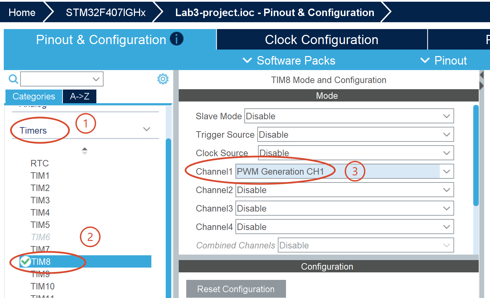
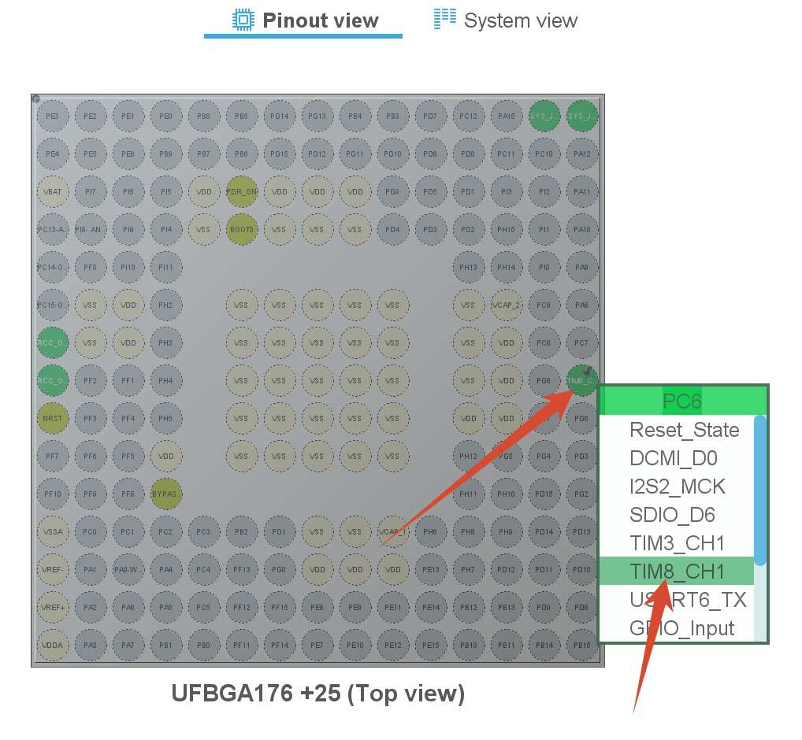
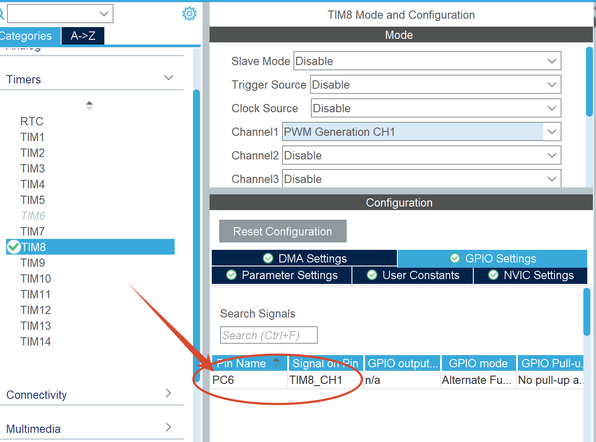
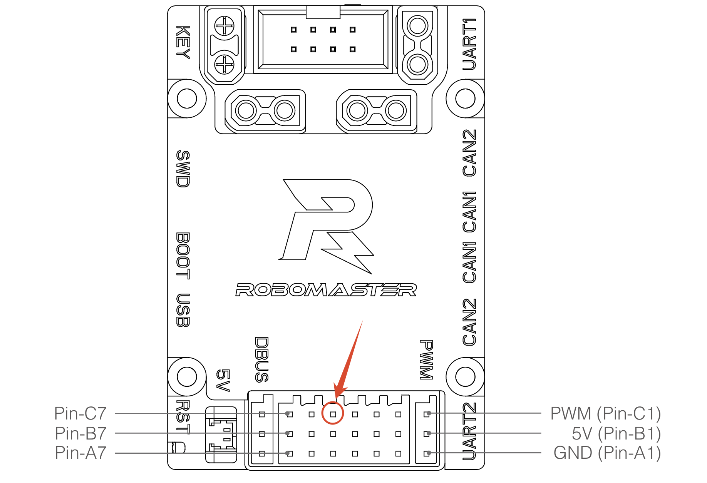
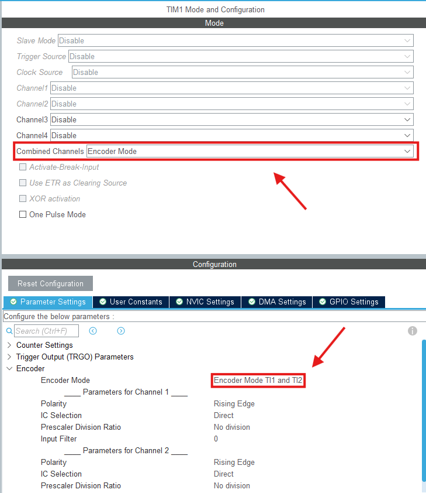
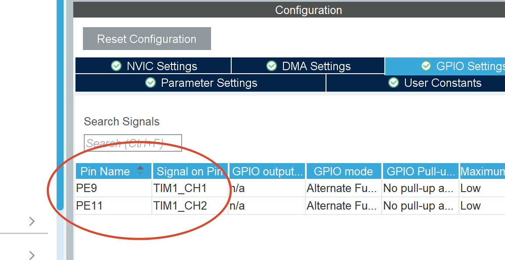
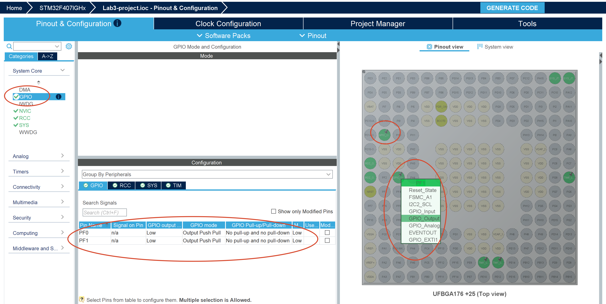
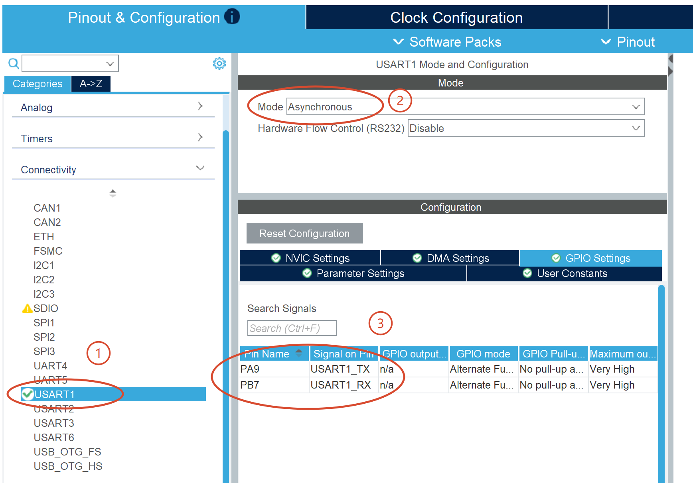
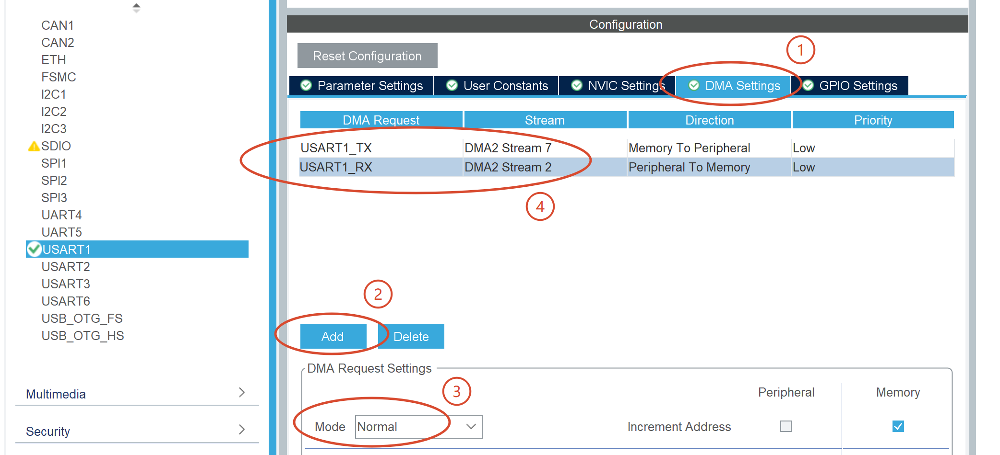
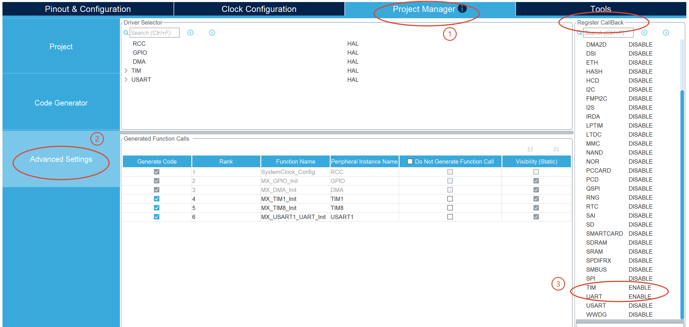

# 使用 CubeMX 进行 STM32F407 外设配置

本章基于 RoboMaster C 型开发板，对应 MCU 为 `STM32F407IGH6`，使用 CubeMX 进行外设配置。

开发板用户手册下载：[官网](https://www.robomaster.com/zh-CN/products/components/general/development-board-type-c)

### 1 配置 PWM 输出

使用 `TIM8` 的 PWM 输出功能来控制电机转速。

找到外设定时器 `TIM8`，将 CH1 配置为 PWM 输出

 

CubeMX 默认使用了 `PI5` 作为 `TIM8_CH1` 的输出引脚，但是阅读开发板手册可以得知，C 板只暴露了 `PC6` 引脚。故我们需要将 `TIM8_CH1` 的输出引脚修改为 `PC6`。

在 CubeMX 的芯片引脚图中找到 `PC6`，点击将其配置为 `TIM8_CH1`：

 

可在 `TIM8` 的配置中确认 `TIM8_CH1` 的引脚已经修改为 `PC6`：

 

> 问题：阅读 C 板用户手册，找到 `TIM8_CH1` 信号最后输出在哪个引脚上。
>
> 答案：在手册中搜索 `TIM8_CH1`，找到原理图，可以发现它连接在 `J16` 连接器的 `C5` 引脚上。最后找到 `C5` 引脚在开发板上的位置：
>
> 

### 2 配置 Encoder Interface

使用 `TIM1` 的硬件编码器接口来读取电机的转速和位置。

- 找到外设定时器 `TIM1`
- Combined Channels 选择 `Encoder Mode`
- Encoder Mode 选择 `Encoder Mode T1 and T2`

 

在芯片引脚图中，分别将 `PE9` 和 `PE11` 配置为 `TIM1_CH1` 和 `TIM1_CH2`，然后确认：

 

> 问题：阅读 C 板用户手册，找到 `TIM1_CH1` 和 `TIM1_CH2` 信号最后输出在哪个引脚上。

### 3 配置 GPIO 输出

使用 `PF0` 和 `PF1` GPIO 输出控制电机的正反转。

在芯片引脚图中，将 `PF0` 和 `PF1` 配置为 `GPIO_Output`，然后确认：

 

> 问题：阅读 C 板用户手册，找到 `PF0` 和 `PF1` 信号最后输出在哪个引脚上。
>
> 答案：
>
> 

### 4 配置 UART 串口通信

`USART1` 外设支持同步（Synchronous）和异步（Asynchronous）两种通信模式，我们使用异步模式进行通信，以下简称为 `UART1`。

MCU `STM32F407IGH6` 上的片上外设 `UART1` 对应 C 板丝印上的 `UART2` 接口（4-pin）。查看 C 板用户手册，我们需要分别配置收发接口：`USART1_RX` 和 `USART1_TX` 为 `PB7` 和 `PA9`：

 

为 TX 和 RX 分别配置 DMA，都设为 Normal 模式：

 

### 5 启用 Register Callback

CubeMX 默认没有启用 Register Callback 功能，只能使用 HAL 库提供的弱函数（Weak Function）来实现外设中断回调函数。为了让我们的代码组织更清晰，我们需要启用 Register Callback 功能。

 

### 6 首尾工作

在 CubeMX 中点击生成代码。

用 EIDE 在构建项目进行测试。如果编译出错，检查修正 EIDE 中的构建配置。如果确认 EIDE 配置正确，但仍然构建出错，则有可能是 EIDE 的构建缓存出现了问题，可以重启 VS Code 再次尝试构建。

构建检查通过后，提交到 Git 仓库。
