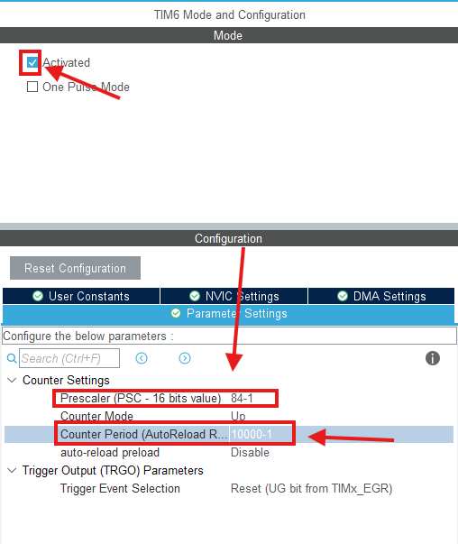
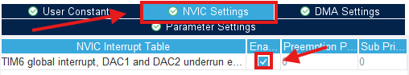
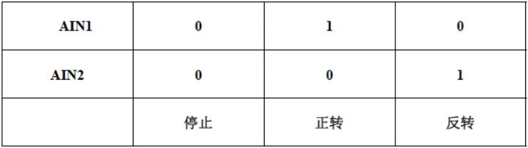

#### 5.1.1 配置定时器中断
- 启用TIM6
- 根据手册判断主频
- 将中断配置为100Hz
- 启用中断

#### 5.1.1 配置PWM输出
- 找到TIM8
- 将CH1配置为PWM输出
- 将CH1引脚修改到PC6
- 根据手册判断主频
- 按照PWM输出频率为1KHz计算并配置分频，在此我们把ARR设置为5000-1，这意味着我们的PWM的分辨率为5000

#### 5.1.2 配置Encoder Interface
- 找到TIM1
- Combined Channels 选择 `Encoder Mode`
- Encoder Mode 选择 `Encoder Mode T1 and T2`
- 同理将CH1, CH2分别配置为 `PE9` `PE11`

#### 5.1.3 配置UART
- 找到USART1
- 选择异步模式
- 配置引脚
- 打开中断

#### 5.1.4 配置GPIO输出
电机的驱动芯片采用TB6612，其真值图如下

因此我们需要两个GPIO来控制
在此我们按照上一节课的方法，配置好 `PF0` `PF1`为OUTPUT
