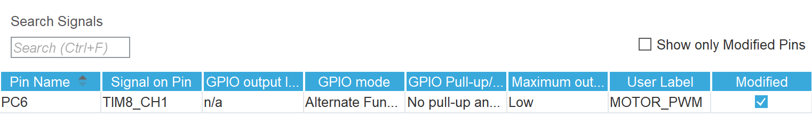

#### 1.1 配置PWM输出
- 找到TIM8
- 将CH1配置为PWM输出
- 将CH1引脚修改到PC6
- 根据手册判断主频
- 按照PWM输出频率为1KHz计算并配置分频，在此我们把ARR设置为5000-1，这意味着我们的PWM的分辨率为5000

#### 1.2 配置Encoder Interface
- 找到TIM1
- Combined Channels 选择 `Encoder Mode`
- Encoder Mode 选择 `Encoder Mode T1 and T2`
- 同理将CH1, CH2分别配置为 `PE9` `PE11`

#### 1.3 配置GPIO输出

在此我们按照上一节课的方法，配置好 `PF0` `PF1`为OUTPUT
