# F401 项目初始化

目的：创建并配置 STM32F401 项目，确保开发环境和工具链正确设置。

## 整体流程

<!-- @import "[TOC]" {cmd="toc" depthFrom=3 depthTo=4 orderedList=false} -->

<!-- code_chunk_output -->

- [1. 创建并生成 CubeMX 工程项目](#1-创建并生成-cubemx-工程项目)
- [2. 初始化 Git 仓库](#2-初始化-git-仓库)
  - [（可选）创建 GitHub 仓库并推送代码](#可选创建-github-仓库并推送代码)
- [3. 将 CubeMX 工程改为 EIDE 项目](#3-将-cubemx-工程改为-eide-项目)
  - [3.1 创建 EIDE 项目](#31-创建-eide-项目)
  - [3.2 配置 EIDE 项目](#32-配置-eide-项目)
  - [3.3 从 Git 仓库中移除 Makefile 文件](#33-从-git-仓库中移除-makefile-文件)
- [4. 使用 CubeMX 进行 MCU 配置](#4-使用-cubemx-进行-mcu-配置)
  - [4.1 配置 SWJ 调试端口](#41-配置-swj-调试端口)
  - [4.2 配置时钟树](#42-配置时钟树)

<!-- /code_chunk_output -->

## 详细步骤

### 1. 创建并生成 CubeMX 工程项目

进入芯片选择器，选择 STM32F401CCU6 芯片：

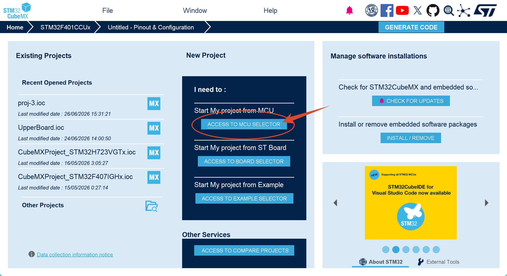
<br/>
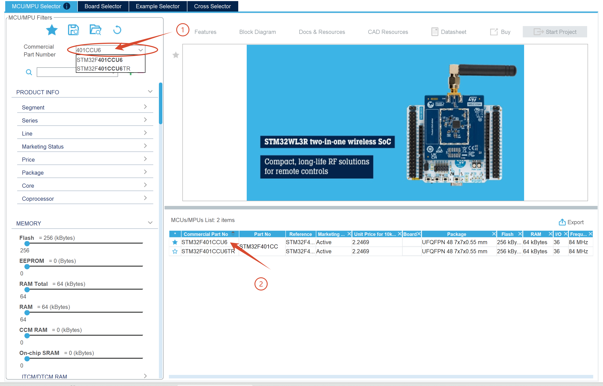
<br/>

等待联网下载相关固件包，完毕后 CubeMX 会自动进入项目配置界面。

进入 Project Manager 页面，进行项目基础配置。项目名称和路径**不可包含中文字符**。本文档以 `Lab3-project` 为例：

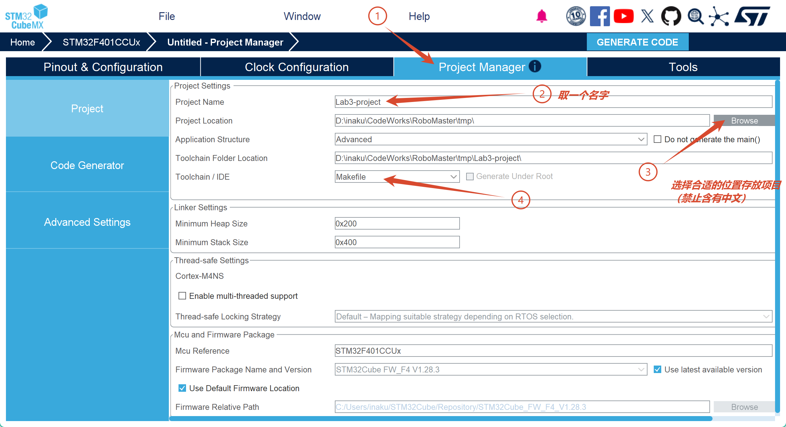
<br/>
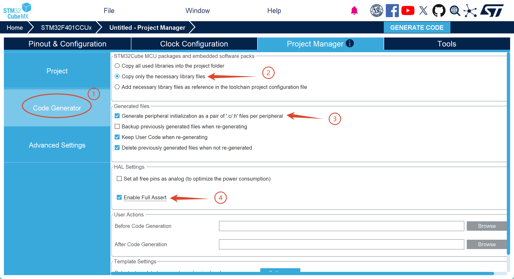
<br/>

配置完成后，点击生成代码：

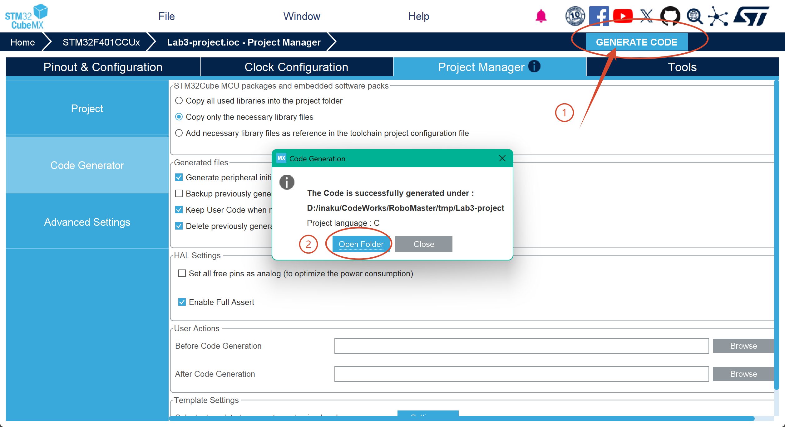
<br/>

### 2. 初始化 Git 仓库

进入项目文件夹，打开终端。

> 由于 GitHub 现行的默认分支名称为 `main`，可能与 Git 的默认分支名称 `master` 不一致，因此建议执行以下命令，将 Git 的默认分支名称设置为 `main`：
>
> ```bash
> git config --global init.defaultBranch main
> ```
>
> 这是一个全局设置，这意味着以后创建的所有 Git 仓库都会使用 `main` 作为默认分支名称。

初始化 Git 仓库：

```bash
git init
```

此时，Git 会在当前目录中创建一个隐藏的 `.git` 文件夹，用于存储版本控制信息。

将刚才生成的代码和 CubeMX 的配置信息添加到第一个提交中：

```bash
git add .
git commit -m "Init CubeMX project"
```

#### （可选）创建 GitHub 仓库并推送代码

在 GitHub 上创建一个新的仓库，然后将本地代码推送到远程仓库：

```bash
git remote add origin <your-github-repo-url>
git push -u origin main
```

其中，`<your-github-repo-url>` 是你在 GitHub 上创建的仓库的 URL，其格式形如 `https://github.com/<user-name>/<repo-name>.git`。

### 3. 将 CubeMX 工程改为 EIDE 项目

#### 3.1 创建 EIDE 项目

用 VS Code 打开 CubeMX 项目所在目录，进入 EIDE 侧边栏。

选择“新建项目” - “空项目” - “Cotex-M 项目”。项目名称需与之前的 CubeMX 工程名称一致；选择项目保存位置时，需选择 CubeMX 项目的**上一层**目录：

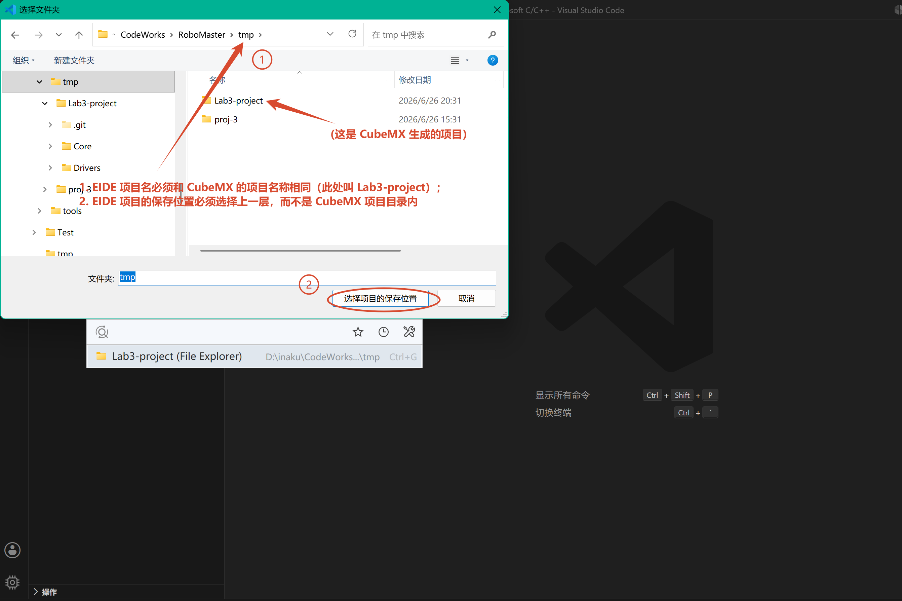
<br/>

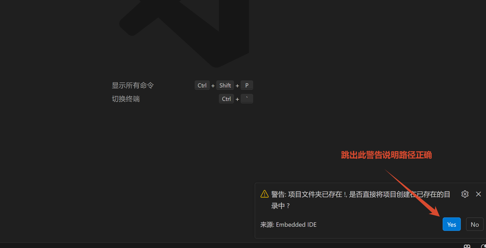
<br/>
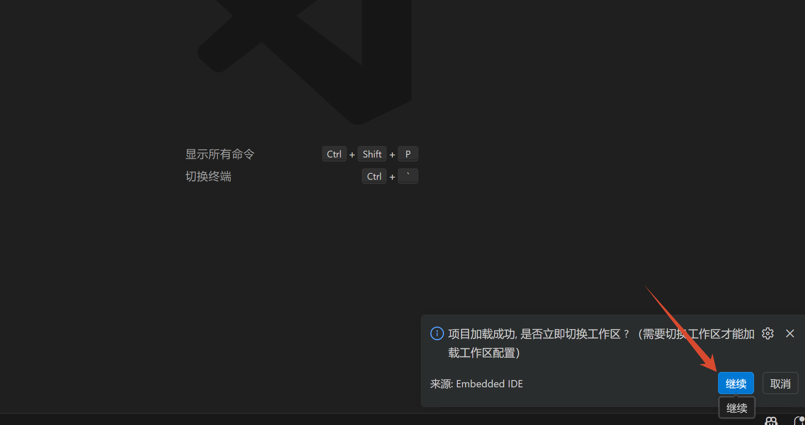
<br/>

接下来，使用 VS Code 的 Git GUI 侧边栏，或打开 VS Code 终端，完成下述 Git 操作。

观察一下 EIDE 项目新增、修改的文件：

```bash
git status
```

然后提交到 Git 仓库：

```bash
git add .
git commit -m "Init EIDE project"
```

#### 3.2 配置 EIDE 项目

打开 VS Code 工作区后，进入 EIDE 侧边栏，进行如下图中配置。

注意：

- 在项目资源中添加文件夹时，选择“普通文件夹”；
- 添加 `.s` 汇编文件时，需在 Windows 文件对话窗口中选择 asm 文件类型，否则可能无法显示 `.s` 文件。

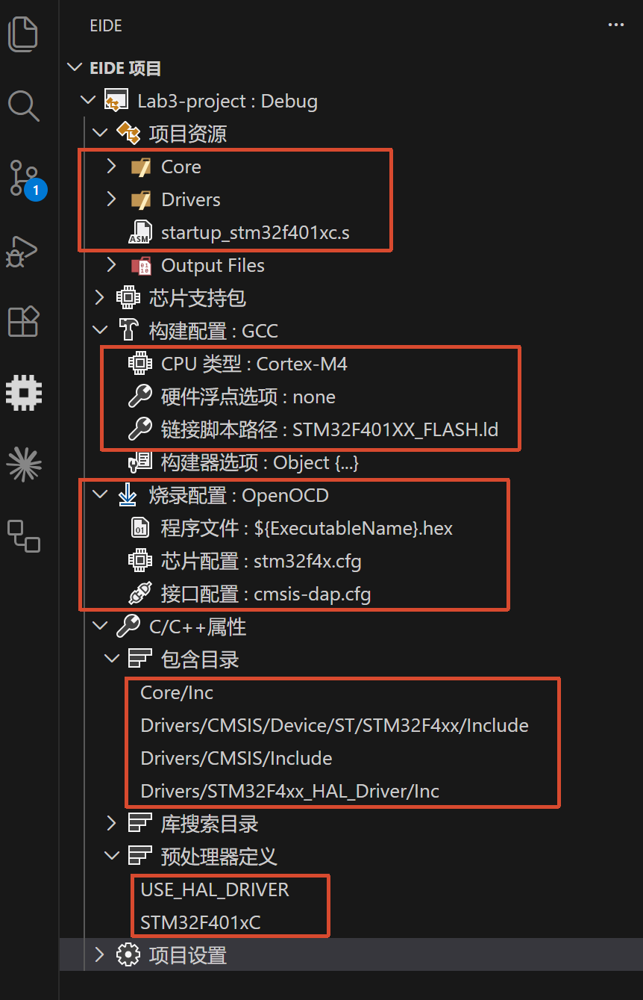
<br/>

观察一下 Git 仓库的状态：

```bash
git status
```

此时，应该显示只有 `.eide/eide.yml` 文件被修改了。将其提交到 Git 仓库：

```bash
git add .
git commit -m "Configure EIDE project"
```

#### 3.3 从 Git 仓库中移除 Makefile 文件

CubeMX 会在项目根目录中生成一个 `Makefile` 文件，但 EIDE 项目不需要它，且每次生成代码时很容易产生不必要的更改。

为了保持 Git 仓库的整洁，这里我们把它移除：

1. 手动删除 `Makefile` 文件，或者在终端中执行：

```bash
git rm Makefile
```

2. 在 `.gitignore` 文件中加入 `Makefile`，让 Git 以后都忽略它：

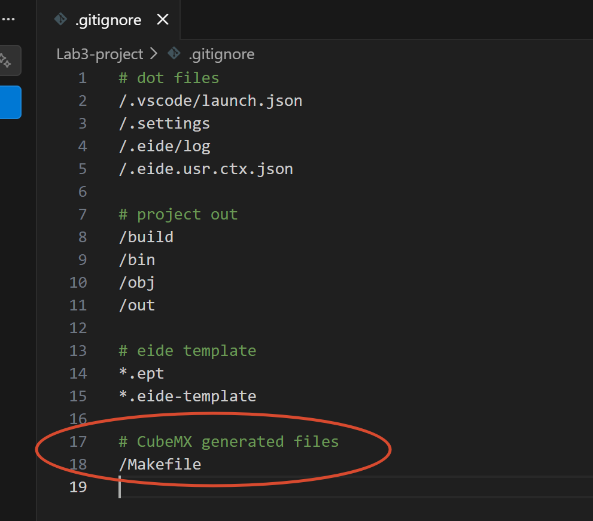

3. 暂存并提交更改：

```bash
git add .
git commit -m "Ignore CubeMX-generated Makefile"
```

### 4. 使用 CubeMX 进行 MCU 配置

打开 `.ioc` 文件，进入 CubeMX 配置界面。

#### 4.1 配置 SWJ 调试端口

启用 SWD（Serial Wire Debug）调试端口，以支持程序烧录和调试：

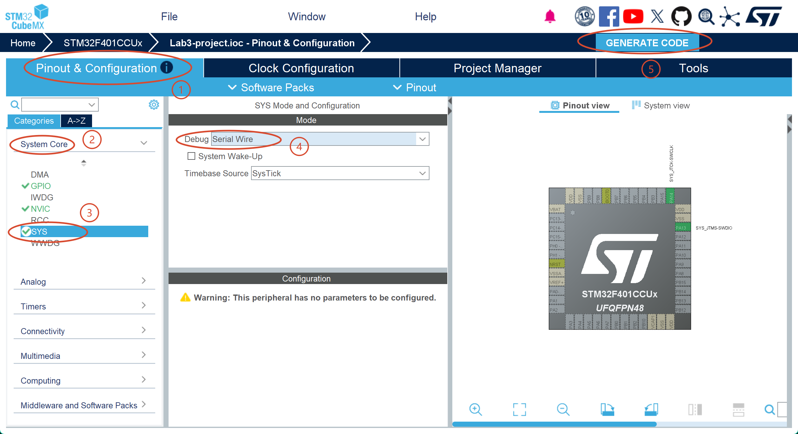

然后点击生成代码。完成后，提交更改：

```bash
git add .
git commit -m "Enable SWD"
```

烧录程序需通过 SWD 接口。一般来说，它包含 4 个引脚：

- `3V3`：3.3 V 供电，或提供参考电平
- `GND`：地线
- `SWDIO` 或 `DIO`：数据线（双向）
- `SWCLK` 或 `CLK`：时钟线

烧录或调试时，这些引脚需要连接到调试器（如 ST-Link、J-Link、DAP-Link 等）的对应引脚上，再通过 USB 连接到电脑。

#### 4.2 配置时钟树

我们使用的 STM32F401 核心板原理图如下：

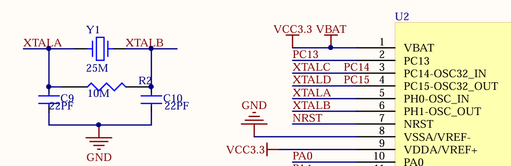

其中，`Y1` 是核心板上的一个 25 MHz 晶振。它被连接到 STM32F401 芯片的 `OSC_IN` 和 `OSC_OUT` 引脚上。

`OSC` 用于连接外部高速时钟源，对应 `HSE`（High-Speed External）；而 `OSC32` 用于连接外部低速时钟源，对应 `LSE`（Low-Speed External）。

所以我们在 CubeMX 中启用 `HSE`，并将其配置为晶振模式（Crystal/Ceramic Resonator）：

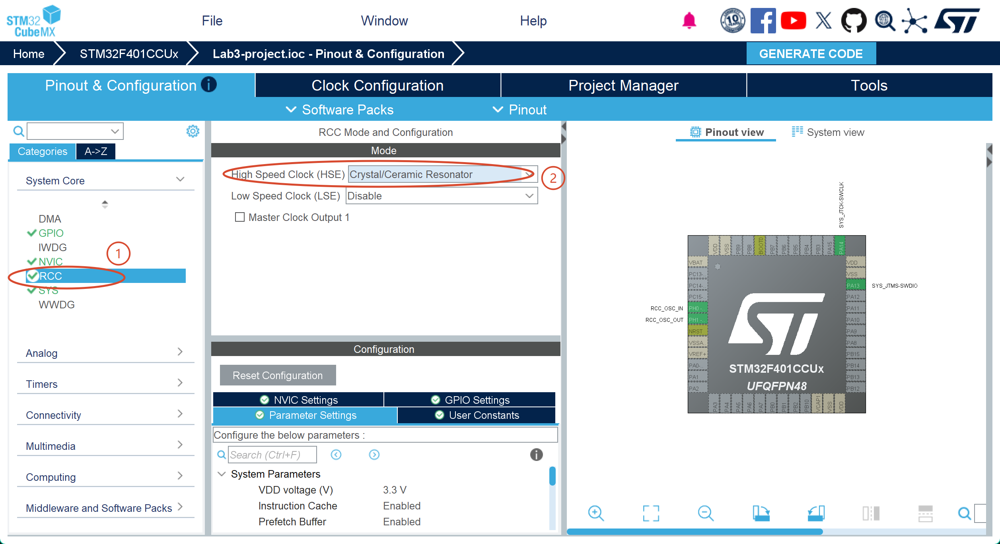

然后配置时钟树：

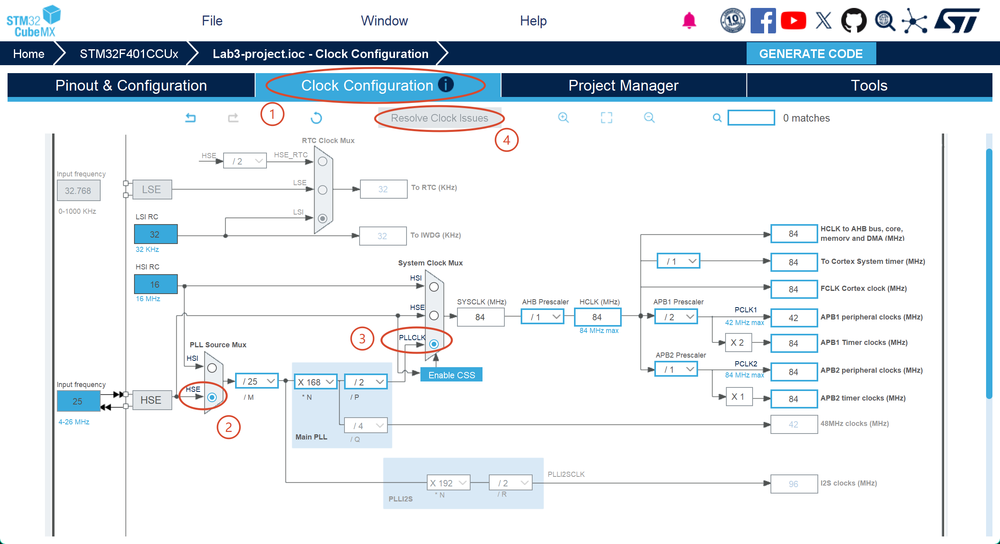

Resolve Clock Issues 之后，注意对比一下是否和图中的配置一致。

然后点击生成代码。完成后，提交更改：

```bash
git add .
git commit -m "Configure clock tree"
```
