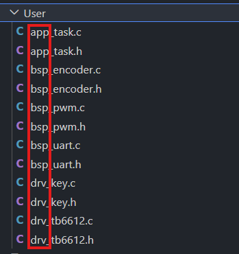

# 将之前完成的代码移植
## 一、确定底板需要实现的功能
### 1.1 基本功能

为了实现下层板控制地盘运动逻辑，我们需要让下层板实现以下基本功能
- 驱动电机通过PWM实现正反转
- 读取电机编码器
- 借助定时器中断实现PID控制速度闭环

### 1.2 通讯功能

同时，我们还需要完成与上位机的通信。因此我们需要
- UART串口通讯

## 二、移植代码

### 2.1 可移植性

在之前，我们已经完成了使用TB6612驱动电机变速运转的功能，因此我们是否可以使用之前的代码呢？

这就要提到我们之前一直在使用，但还没有详细展开过的项目结构了



我们可以看到，在文件名的开始，我们使用了 `app` `bsp` `drv` 这些前缀。在实际项目结构中，这意味着我们的文件分层

- `bsp` = `board support packets`(板级支持包)，这通常表明，这个文件是对于某一种型号专门的支持包，可移植性较差

- `drv` = `drivers` ，对于一个解耦良好的代码，drv层一般都具有较好的可移植性

- `app` = `application` ，通常来说，在drv层解耦良好的代码，其app层可以直接移植

### 2.2 先判断哪些文件不能直接移植

移植代码时，不能看到文件就直接复制。两个工程使用的芯片、定时器、引脚和外设初始化可能不同，因此要先区分“业务逻辑”和“硬件绑定”。

旧代码来自一个 `STM32F407` 工程，而当前工程是 `STM32F401`。因此，即使你以后拿到了完整旧工程，下面这些文件也不能直接覆盖到当前工程：

- `Core/Inc`、`Core/Src` 中由 CubeMX 生成的外设初始化文件，例如 `main.c`、`gpio.c`、`tim.c`、`usart.c`
- 启动文件，例如 `startup_stm32f407xx.s`
- 链接脚本，例如 `STM32F407XX_FLASH.ld`
- `.ioc` 工程配置文件

这些文件和芯片型号、时钟树、引脚复用、Flash/RAM 大小强相关。如果直接覆盖，很容易出现芯片型号不匹配、外设句柄不存在、引脚宏不存在等问题。

本次会涉及的代码可以分成三类：

| 文件或模块 | 你需要做什么 | 原因 |
| --- | --- | --- |
| `bsp_pwm.c/h` | 自己编写 | 逻辑短，适合练习定时器 PWM 输出 |
| `drv_tb6612.c/h` | 自己编写，必要时参考提供框架 | 控制逻辑清楚，但四电机映射略多 |
| `module_pid.c/h` | 自己编写 | 用 CMSIS-DSP 的 PID，封装较短 |
| `bsp_encoder.c/h` | 提供代码 | 四路编码器、计数溢出处理较复杂 |
| `drv_motor.c/h` | 提供代码 | 负责连接编码器、TB6612、电机编号和测速缓存，内容较多 |
| `module_chassis_mecanum.c/h` | 提供代码 | 麦轮运动学不是本节迁移重点 |
| `app_chasis.c/h`、`app_under_board_task.c/h`、`app_connectivity.c/h` | 提供代码 | 属于底盘控制和通信框架，代码量较大 |
| `frame_codec.c/h`、`chassis_protocol.h` | 提供代码 | 通信协议工具，不适合在本节展开 |

如果把旧工程 `User` 目录按文件名列出来，大致会看到这些可讨论的文件：

```text
User\bsp_pwm.c
User\bsp_pwm.h
User\drv_tb6612.c
User\drv_tb6612.h
User\bsp_encoder.c
User\bsp_encoder.h
User\bsp_uart.c
User\bsp_uart.h
User\app_task.c
User\app_task.h
```

你不需要拥有这些旧文件。关键代码片段已经写在本文中，复杂文件则作为“提供代码”放在当前工程里。

## 三、创建新工程副本

通常，我们会基于重新建立的框架上移植我们的代码

也就是说，我们不是把旧 F407 工程整体搬进来，而是以 F401 工程为底座，把旧工程中适合复用的 `User` 层代码迁进来。

## 四、迁移 PWM 代码

> 本节需要你自己编写。

### 4.1 旧工程 PWM 的核心逻辑

旧工程的 `bsp_pwm.c` 很简单，核心就是设置定时器比较值：

```c
void setPwmDuty(uint32_t duty)
{
    if(duty > 4999)
        return;
    __HAL_TIM_SET_COMPARE(&htim8, TIM_CHANNEL_1, duty);
}
```

这段代码中，真正可以复用的是：

```c
__HAL_TIM_SET_COMPARE(...)
```

不能直接复用的是：

```c
&htim8
TIM_CHANNEL_1
4999
```

因为旧工程使用的是 `TIM8 CH1`，而当前 F401 下层板工程使用的是 `TIM5 CH1~CH4` 来驱动四个电机 PWM。

### 4.2 新工程中的 PWM 适配

在当前工程中，创建：

```text
.\User\bsp\bsp_pwm.h
.\User\bsp\bsp_pwm.c
```

同时，由于我们有四路PWM，因此我们在此建立一个枚举类型来表示

```c
typedef enum
{
    PWM_CH_FL = 0,
    PWM_CH_FR,
    PWM_CH_RL,
    PWM_CH_RR,
    PWM_CH_NUM
} PWM_Channel_t;
```

四路 PWM 与定时器通道的映射为：

```c
static const PWM_Config_t pwm_config[PWM_CH_NUM] = {
    [PWM_CH_FL] = {&htim5, TIM_CHANNEL_1},
    [PWM_CH_FR] = {&htim5, TIM_CHANNEL_2},
    [PWM_CH_RL] = {&htim5, TIM_CHANNEL_4},
    [PWM_CH_RR] = {&htim5, TIM_CHANNEL_3},
};
```

- 旧代码：一个电机，只需要 `setPwmDuty(duty)`
- 新代码：四个电机，因此要增加 `PWM_Channel_t channel`
- 不变的核心：仍然是通过 `__HAL_TIM_SET_COMPARE()` 设置 PWM 占空比


## 五、迁移 TB6612 驱动

> 本节需要你自己编写。

### 5.1 旧工程 TB6612 的核心逻辑

旧工程的 `drv_tb6612.c` 做了几件事：

- 初始化 PWM
- 设置 TB6612 的 `IN1/IN2` 方向引脚
- 设置 PWM duty
- 根据目标 RPM 决定方向和占空比

例如旧代码中设置方向的逻辑是：

```c
case TB6612_DIR_FORWARD:
    HAL_GPIO_WritePin(MOTOR_OUT1_GPIO_Port, MOTOR_OUT1_Pin, GPIO_PIN_SET);
    HAL_GPIO_WritePin(MOTOR_OUT2_GPIO_Port, MOTOR_OUT2_Pin, GPIO_PIN_RESET);
    break;
```

这个逻辑可以复用，因为 TB6612 的控制方式没有变：

- `IN1=1, IN2=0`：正转
- `IN1=0, IN2=1`：反转
- `IN1=1, IN2=1`：刹车
- `IN1=0, IN2=0`：停止/滑行

但旧代码里只有一组 `MOTOR_OUT1` / `MOTOR_OUT2`，当前底板有四个电机，所以也需要扩展为多通道。

### 5.2 新工程中的 TB6612 适配

在当前工程中，我们创建：

```text
.\User\drv\drv_tb6612.h
.\LowerBoard\User\drv\drv_tb6612.c
```

并定义四个 TB6612 通道：

```c
typedef enum
{
    TB6612_CH_FL = 0,
    TB6612_CH_FR,
    TB6612_CH_RL,
    TB6612_CH_RR,
    TB6612_CH_NUM
} TB6612_Channel_t;
```

每个通道绑定一组方向引脚和一路 PWM：

```c
static TB6612_Config_t tb6612[TB6612_CH_NUM] = {
    [TB6612_CH_FL] = {FL_OUT1_GPIO_Port, FL_OUT1_Pin, FL_OUT2_GPIO_Port, FL_OUT2_Pin, PWM_CH_FL, 0.0f},
    [TB6612_CH_FR] = {FR_OUT1_GPIO_Port, FR_OUT1_Pin, FR_OUT2_GPIO_Port, FR_OUT2_Pin, PWM_CH_FR, 0.0f},
    [TB6612_CH_RL] = {RL_OUT1_GPIO_Port, RL_OUT1_Pin, RL_OUT2_GPIO_Port, RL_OUT2_Pin, PWM_CH_RL, 0.0f},
    [TB6612_CH_RR] = {RR_OUT1_GPIO_Port, RR_OUT1_Pin, RR_OUT2_GPIO_Port, RR_OUT2_Pin, PWM_CH_RR, 0.0f},
};
```

因此旧工程的单电机函数：

```c
TB6612_SetRPM(100.0f);
```

在新工程中扩展为：

```c
TB6612_SetRPM(TB6612_CH_FL, 100.0f);
```

这就是移植中最常见的改法：保留旧代码的控制思想，增加新硬件需要的参数。

## 六、连接到上层电机驱动

> 本节使用课程提供代码。原因是 `drv_motor` 同时处理四个电机的编号、输出方向反转、编码器反向、速度换算和缓存状态，内容较多。你需要重点理解它如何把刚刚写好的 `drv_tb6612` 接到上层。

当前工程已经有更高一层的电机抽象：

```text
.\User\drv\drv_motor.c
.\User\drv\drv_motor.h
```

`drv_motor` 的作用是把“底盘四个电机”的概念和底层 TB6612 驱动连接起来。

提供代码中，`drv_motor.c` 原本可能调用旧的 `bsp_tb6612`：

```c
#include "bsp/bsp_tb6612.h"
```

我们需要把它改为调用刚刚迁移得到的 TB6612 驱动：

```c
#include "drv_tb6612.h"
```

并在内部建立电机编号到 TB6612 通道的映射：

```c
static const TB6612_Channel_t channel_map[MOTOR_NUM] = {
    [MOTOR_FL] = TB6612_CH_FL,
    [MOTOR_FR] = TB6612_CH_FR,
    [MOTOR_RL] = TB6612_CH_RL,
    [MOTOR_RR] = TB6612_CH_RR,
};
```

这样上层应用只需要调用：

```c
Motor_SetOutputPercent(MOTOR_FL, 50.0f);
```

底层就会经过：

```text
Motor_SetOutputPercent
  -> Motor_SetOutput
    -> TB6612_SetDirection
    -> TB6612_SetDuty
      -> PWM_SetDuty
```

通过这个调用链可以看出各层的职责：

- `app` 层关心“车要怎么动”
- `drv_motor` 关心“四个电机分别输出多少”
- `drv_tb6612` 关心“TB6612 怎么控制方向和占空比”
- `bsp_pwm` 关心“具体哪个定时器通道输出 PWM”

## 七、编码器代码的迁移思路

> 本节使用课程提供代码。你只需要理解迁移思路，不需要完整写出四路编码器驱动。

旧工程的编码器代码使用单个定时器读取一个电机转速：

```c
HAL_TIM_Encoder_Start(&htim1, TIM_CHANNEL_ALL);
```

当前底盘有四个电机，因此新工程中的 `bsp_encoder` 保留了类似思想，但扩展为四路编码器：

```text
.\User\bsp\bsp_encoder.c
.\User\bsp\bsp_encoder.h
```

四个编码器通道映射如下：

```c
static Encoder_t encoder[PWM_ENCODER_NUM] = {
    [PWM_ENCODER_CH1] = {&htim1, 0x0000FFFFu, 0u, 0, 0},
    [PWM_ENCODER_CH2] = {&htim2, 0xFFFFFFFFu, 0u, 0, 0},
    [PWM_ENCODER_CH3] = {&htim3, 0x0000FFFFu, 0u, 0, 0},
    [PWM_ENCODER_CH4] = {&htim4, 0x0000FFFFu, 0u, 0, 0},
};
```

编码器和 PWM 一样，旧工程的单通道代码不能直接覆盖，但“读取计数器、计算差值、换算速度”的思路可以迁移。

## 八、PID 改用 CMSIS-DSP

> 本节需要你自己编写 `module_pid.c/h` 这一层封装。DSP 库源码由课程提供，不需要你实现 DSP 库本身。

### 8.1 为什么不用旧的手写 PID

DSP 库放在：

```text
.\Libs\CMSIS-DSP-1.17.0
```

这个目录属于课程提供代码，不需要你手动实现 DSP 库。

实际用到的源码是：

```text
Libs\CMSIS-DSP-1.17.0\Source\arm_pid_init_f32.c
Libs\CMSIS-DSP-1.17.0\Source\arm_pid_reset_f32.c
```

需要包含的头文件路径是：

```text
Libs\CMSIS-DSP-1.17.0\Include
```

### 8.2 对上层保留原来的 PID 接口

为了减少上层代码改动，我们仍然保留：

```c
PID_Init(...)
PID_SetParam(...)
PID_Reset(...)
PID_Calc(...)
```

但在 `PID_t` 内部使用 DSP 的结构体：

```c
arm_pid_instance_f32 dsp_pid;
```

初始化时调用：

```c
arm_pid_init_f32(&pid->dsp_pid, 1);
```

计算时调用：

```c
output = arm_pid_f32(&pid->dsp_pid, pid->error);
```

复位时调用：

```c
arm_pid_reset_f32(&pid->dsp_pid);
```

也就是说，上层底盘控制代码可以写：

```c
float output = PID_Calc(&app_chasis_speed_pid[i], target, feedback, dt_s);
```

但真正执行 PID 算法的是 CMSIS-DSP。

### 8.3 需要注意的区别

CMSIS-DSP 的 `arm_pid_f32()` 接收的是误差值 `error`，而不是 `setpoint` 和 `feedback`：

```c
pid->error = setpoint - feedback;
output = arm_pid_f32(&pid->dsp_pid, pid->error);
```

此外，CMSIS-DSP 的 PID 没有单独的积分限幅接口，所以 `PID_SetIntegralLimit()` 在当前封装中只保留为兼容接口。真正保留的限幅是输出限幅：

```c
pid->output = PID_Clamp(output, pid->output_min, pid->output_max);
```

## 九、更新 EIDE 工程配置

> 本节配置通常已经随课程工程提供。你需要检查新增文件后 `srcDirs` 和 `incList` 是否包含对应路径。

移植代码之后，要让 EIDE 知道新增了哪些源码和头文件路径。

当前 EIDE 工程配置文件是：

```text
demo\LowerBoard\.eide\eide.yml
```

需要确认 `srcDirs` 中包含：

```yaml
srcDirs:
  - Core
  - Drivers
  - User
  - Libs
  - ../include
```

这样 EIDE 才会扫描：

- `User` 下迁移进来的业务代码
- `Libs` 下的 CMSIS-DSP 源码
- `../include` 下的公共协议头文件

还需要确认头文件路径 `incList` 中包含：

```yaml
incList:
  - User
  - Core/Inc
  - Drivers/CMSIS/Include
  - Drivers/CMSIS/Device/ST/STM32F4xx/Include
  - Drivers/STM32F4xx_HAL_Driver/Inc
  - Libs/CMSIS-DSP-1.17.0/Include
  - ../include
```

如果缺少 `Libs/CMSIS-DSP-1.17.0/Include`，就会找不到：

```c
#include "dsp/controller_functions.h"
```

如果缺少 `../include`，就会找不到：

```c
#include "common/frame_codec.h"
#include "common/chassis_protocol.h"
```


## 十、最终工程结构

移植完成后，重点文件如下：

```text
demo\LowerBoard
├─ Core                         # F401 CubeMX 生成代码，保留新工程的
├─ Drivers                      # F401 HAL/CMSIS，保留新工程的
├─ Libs
│  └─ CMSIS-DSP-1.17.0          # 新增 DSP PID 依赖
├─ User
│  ├─ app                       # 提供代码：底盘应用、通信任务、测试任务
│  ├─ bsp
│  │  ├─ bsp_pwm.c/h            # 自己编写：从旧 PWM 思路迁移并扩展
│  │  ├─ bsp_encoder.c/h        # 提供代码：四路编码器 BSP
│  │  ├─ bsp_uart.c/h           # 提供代码
│  │  ├─ bsp_timer.c/h          # 提供代码
│  │  └─ bsp_crc.c/h            # 提供代码
│  ├─ drv
│  │  ├─ drv_tb6612.c/h         # 自己编写：从旧 TB6612 思路迁移并扩展
│  │  └─ drv_motor.c/h          # 提供代码：电机抽象层，连接 TB6612 与底盘
│  └─ modules
│     ├─ module_pid.c/h         # 自己编写：CMSIS-DSP PID 封装
│     └─ module_chassis_mecanum.c/h # 提供代码：麦轮运动学
├─ .eide
│  └─ eide.yml                  # EIDE 工程配置
├─ Makefile
├─ LowerBoard.ioc
├─ startup_stm32f401xc.s
└─ STM32F401XX_FLASH.ld
```

